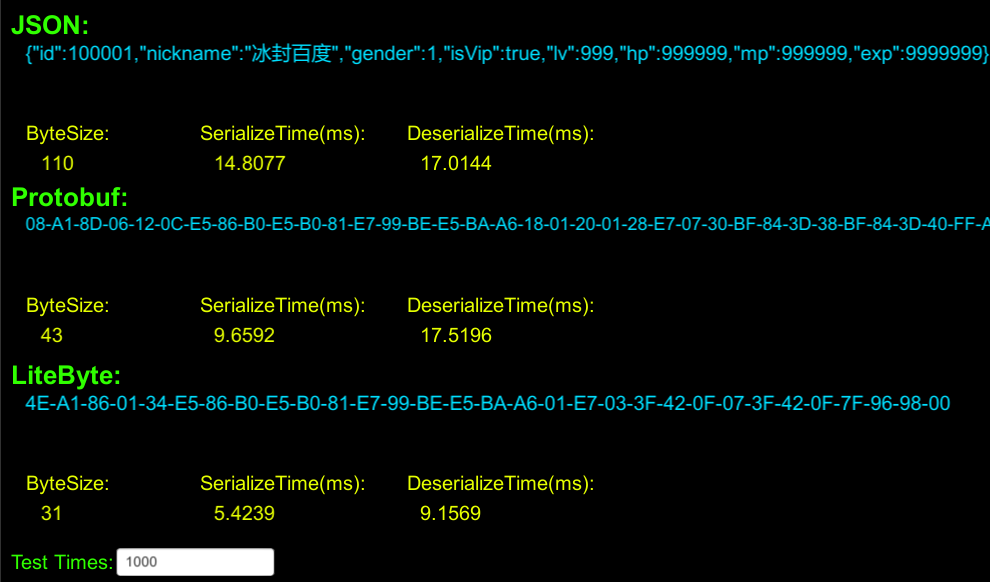

[中文版](https://segmentfault.com/a/1190000021329368)
# LiteByte
<br/>
LiteByte is a lightweight binary data interchange format

# Explain
**Version**:0.6.10<br/>
**Author**:ZhangYu<br/>
**CreateDate**:2019-05-22<br/>
**LastModifiedDate**:2019-12-16<br/>

## Intro:
LiteByte is a lightweight binary data interchange format.<br/>
Small size and easy to use are the design goals.

## Features：
1.Compact binary data format with small data volume.<br/>
2.Define your own type like wirte a class, easy to use.

## Implementation approach：
An object is divided into two parts: <br/>
Struct, which is defined by a configuration file, as simple as possible.<br/>
Value, which is used for network transmission, as small as possible.<br/>

## Usage：
(1)Create structure file CustomType.lbs(LiteByte Schema is a text file)<br/>
(2)Define object fields(write structure, type, and name just as you write a class)<br/>
(3)Use api LBUtil.Serialize(typeName, object) Serializes the object into binary data,<br/>
   Use api LBUtil.Deserilize(typeName, bytes) Deserialize binary data into objects.<br/>

## Code Sample:
### PlayerInfo.cs(Entity)
```cs
/// <summary> PlayerInfo Entity </summary>
public struct PlayerInfo {

    public uint id;
    public string nickname;
    public byte gender;
    public bool isVip;
    public int lv;
    public int hp;
    public int mp;
    public int exp;

}
```

### PlayerInfo.lbs(LiteByte schema)
```cs
/// <summary> PlayerInfo config </summary>
// Just like writing structs in C#, access modifiers can be left unwritten and ignored when reading configuration files
public struct PlayerInfo {

    public uint id;
    public string nickname;
    public byte gender;
    public bool isVip;
    public int lv;
    public int hp;
    public int mp;
    public int exp;

}
```

### Demo.cs
```cs
// using LiteByte;

// Create Entity
PlayerInfo player = new PlayerInfo();
player.id = 100001;
player.nickname = "冰封百度";
player.gender = 1;
player.isVip = true;
player.lv = 999;
player.hp = 999999;
player.mp = 999999;
player.exp = 9999999;

// Serialize:
string typeName = "PlayerInfo";
byte[] bytes = LBUtil.Serialize(typeName, player);

// Deserialize：
PlayerInfo info = LBUtil.Deserialize<PlayerInfo>(typeName, bytes);
```

### Output:
<br/>

### BaseType
#### Bit(7 Types)
Type | Size | Value Range
 --|--|--
Bit1(Boolean) | 1Bit | 0 ~ 1
Bit2(Byte)    | 2Bit | 0 ~ 3
Bit3(Byte)    | 3Bit | 0 ~ 7
Bit4(Byte)    | 4Bit | 0 ~ 15
Bit5(Byte)    | 5Bit | 0 ~ 31
Bit6(Byte)    | 6Bit | 0 ~ 63
Bit7(Byte)    | 7Bit | 0 ~ 127

#### Integer(16 Types)
Type | Size | Value Range
 --|--|--
Int8(sbyte) | 1Byte | -128 ~ 127
Int16(short)    | 2Byte | -32768 ~ -32767
Int24(int)    | 3Byte | -8388608 ~ 8388607
Int32(int)    | 4Byte | -2147483648 ~ 2147483647
Int40(long)    | 5Byte | -549755813888 ~ 549755813887
Int48(long)    | 6Byte | -140737488355328 ~ 140737488355327
Int56(long)    | 7Byte | -36028797018963968 ~ 36028797018963967
Int64(long)    | 8Byte | -9223372036854775808 ~ 9223372036854775807
UInt8(byte)    | 1Byte | 0 ~ 255
UInt16(ushort) | 2Byte | 0 ~ 65535
UInt24(uint)   | 3Byte | 0 ~ 16777215
UInt32(uint)   | 4Byte | 0 ~ 4294967295
UInt40(ulong)  | 5Byte | 0 ~ 1099511627775
UInt48(ulong)  | 6Byte | 0 ~ 281474976710655
UInt56(ulong)  | 7Byte | 0 ~ 72057594037927935
UInt64(ulong)  | 8Byte | 0 ~ 18446744073709551615

#### Float(5 Types)
Type | Size | Significant Digits | Value Range
 --|--|--|--
Float8(float)  | 1Byte | 7Bit | 0/255 ~ 255/255
Float16(float) | 2Byte | 3Bit | ±6.55E +4
Float24(float) | 3Byte | 5Bit | ±1.8447E +19
Float32(float) | 4Byte | 7Bit | ±3.402823E +38
Float64(double) | 8Byte | 15Bit | ±1.7976931348623157E +308

#### Variable Integer(7 Types)
Type | Size | Value Range
 --|--|--
VarInt16(short) | 1Bit + 1~2Byte | Same as Int16
VarInt32(int)   | 2Bit + 1~4Byte | Same as Int32
VarInt64(long)  | 3Bit + 1~8Byte | Same as Int64
VarUInt16(ushort) | 1Bit + 1~2Byte | Same as UInt16
VarUInt32(uint)   | 2Bit + 1~4Byte | Same as UInt32
VarUInt64(ulong)  | 3Bit + 1~8Byte | Same as UInt64
VarLength(int)    | 3Bit + 1~8Byte | -1 ~ (Int32.MaxValue/2 - 1)

#### String(3 Encodings)
Type | Single Char Size | Total Size Range 
 --|--|--
UTF8(string)  | 1~4Byte | Head(1~4)Byte+Body(0 ~ 1073741822)Byte
Unicode(string)  | 2Byte |  Head(1~4)Byte+Body(0 ~ 1073741822)x2Byte
ASCII(string)  | 1Byte |  Head(1~4)Byte+Body(0 ~ 1073741822)Byte

### Complex Type(2 types)
 Type | Expression
 --   | --
Array  | TypeName[]
Dictionary(Unimpl) | Dictionary<BaseType, TypeName>
CustomType | not the same with base types and array names

*Total:38 Types*

### Others
It is recommended that fields be defined with as small a data type as possible，<br/>
This reduces the size of the serialized data.<br/>

You can give nicknames to basic data types, Define your own style for writing.<br/>

### Custom Type Config(LiteByte Schema) Samples
The base types in the following samples apply the following config by default.<br/>
Bit1      = bool<br/>
Int8      = sbyte<br/>
UInt8     = byte<br/>
VarInt32  = int<br/>
VarUnt32  = uint<br/>
VarInt64  = long<br/>
VarUInt64 = ulong<br/>
UTF8      = string<br/>

#### BaseType Sample 1:
```cs
struct BaseTypeST {

	// Bit
	bool boolValue;

	// Int
	sbyte sbyteValue;
	short shortValue;
	int intValue;
	long longValue;

	// UInt
	byte byteValue;
	ushort ushortValue;
	uint uintValue;
	ulong ulongValue;

	// Float
	float floatValue;
	double doubleValue;

	// String(UTF8)
	string stringValue;

}
```

#### Array sample 1:
```cs
struct ArrayST {
	int[] ids;	
}
```

#### Array sample 2:
```cs
struct ArrayST {
	string[] names;	
}
```
#### Login info Sample:
```cs
struct LoginInfoST {

	string username;
	string password;

}
```

#### User info sample:
```cs
struct UserInfoST {

	uint id;
	string username;
	string nickname;
	int hp;
	int mp;
	long exp;
	long gold;
	byte age;
	bool isVip;

}
```

## Data Type Table
 Type | Size | C# | Java(Unimpl) | C++(Unimpl) | Go(Unimpl)
 -- | -- | -- | -- | -- | -- 
Bit1 | 1Bit | bool | boolean | char | bool
Bit2 | 2Bit | byte | byte | char | bool
Bit3 | 3Bit | byte | byte | char | uint8
Bit4 | 4Bit | byte | byte | char | uint8
Bit5 | 5Bit | byte | byte | char | uint8
Bit6 | 6Bit | byte | byte | char | uint8
Bit7 | 7Bit | byte | byte | char | uint8
Int8  | 1Byte | sbyte | sbyte | char      | int8
Int16 | 2Byte | short | short | short     | int16
Int24 | 3Byte | int   | int   | int       | int32
Int32 | 4Byte | int   | int   | int       | int32
Int40 | 5Byte | long  | long  | long long | int64
Int48 | 6Byte | long  | long  | long long | int64
Int56 | 7Byte | long  | long  | long long | int64
Int64 | 8Byte | long  | long  | long long | int64
UInt8  | 1Byte | byte   | byte   | char      | uint8
UInt16 | 2Byte | ushort | ushort | ushort    | uint16
UInt24 | 3Byte | uint   | uint   | uint      | uint32
UInt32 | 4Byte | uint   | uint   | uint      | uint32
UInt40 | 5Byte | ulong  | ulong  | unsigned long long | uint64
UInt48 | 6Byte | ulong  | ulong  | unsigned long long | uint64
UInt56 | 7Byte | ulong  | ulong  | unsigned long long | uint64
UInt64 | 8Byte | ulong  | ulong  | unsigned long long | uint64
Float8 | 1Byte | float  | float  | float  | float32
Float16| 2Byte | float  | float  | float  | float32
Float24| 3Byte | float  | float  | float  | float32
Float32| 4Byte | float  | float  | float  | float32
Float64| 8Byte | double | double | double | float64
VarInt16 | 1Bit+1~2Byte | short  | short  | short   | int16
VarInt32 | 2Bit+1~4Byte | int    | int    | int     | int32
VarInt64 | 3Bit+1~8Byte | long   | long   |long long| int64
VarUInt16 | 1Bit+1~2Byte | ushort  | ushort  |unsigned short   | uint16
VarUInt32 | 2Bit+1~4Byte | uint    | uint    |unsigned int     | uint32
VarUInt64 | 3Bit+1~8Byte | ulong   | ulong   |unsigned long long| uint64
VarLength | 2Bit+1~4Byte | int  | int  | int   | int32
UTF8    | 1~4Byte | string | string | string | string
Unicode | 2Byte   | string | string | string | string
ASCII   | 1Byte   | string | string | string | string

Due to limited capabilities, only the C# version has been implemented for the time being
